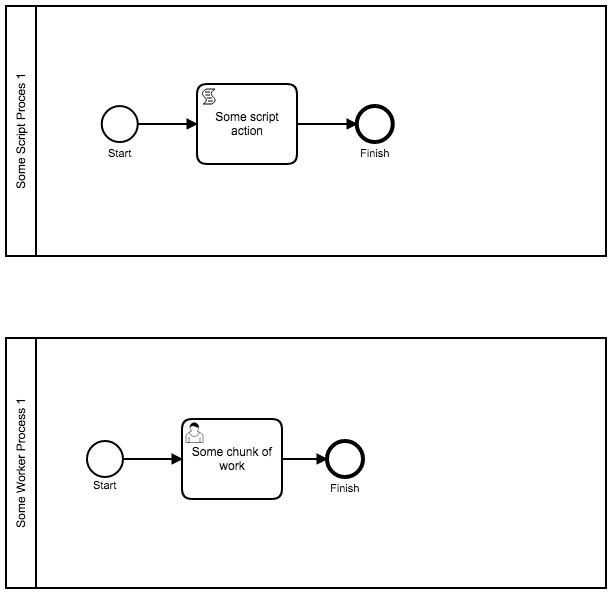
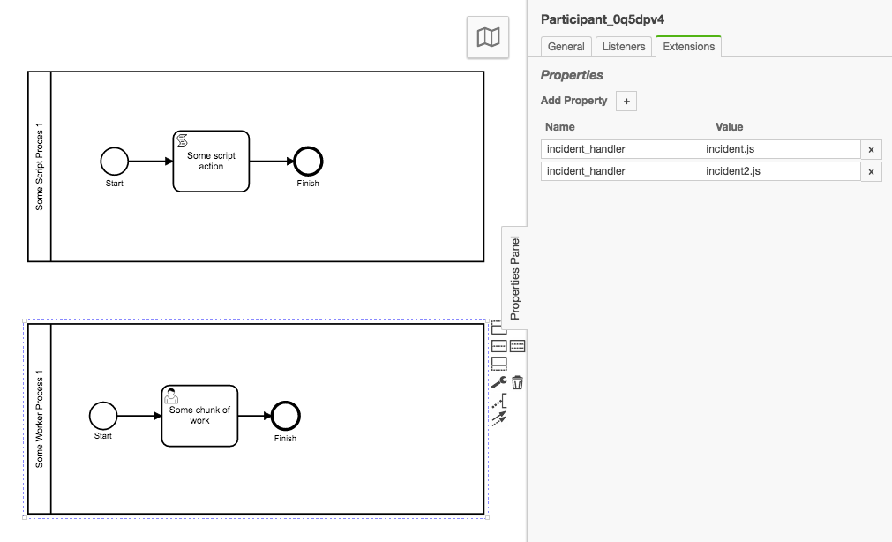
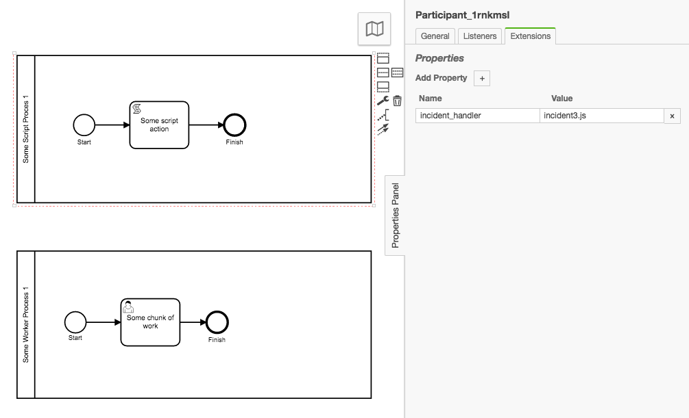

# Custom Incident Handlers Incident Handler 

A Camunda BPM Process Engine Plugin that provides a generic Incident Handler that will execute Nashorn Javascript scripts that are defined as Camunda Extention Properties in the BPMN process.


# What does this do and why does it exist?

Camunda BPM engine requires that a custom incident handler be built and deployed as a Java Jar.  It is not possible to define process or global incident handlers through scripting / without having to write Jars and deploy them to the engine (and the overhead implied by these actions).

This plugin provides a flexible architecture for implementing Incident Handlers on a per process basis with easy to use Camunda Extension Properties that are fully supported in the Camunda Modeler.

For extension property (`incident_handler`) that is applied on on a BPMN process, this plugin will execute the defined script.  The plugin will look for the defined script in the executing process instance's deployment resources.

Within a .js file that is called there are three possible functions that must exist:

1. `handleIncident`
1. `resolveIncident`
1. `deleteIncident`

This function names match the names that are in Camunda's `DefaultIncidentHandler.class`.


# Screenshots





# Setup and Usage

## Install Plugin

## Configure Plugin

## Setup BPMN Extension properties

## Deploy BPMN


# TODO

1. Error Handling
1. Add custom incident type example
1. Log and Debug messages
1. Add example of resolve and delete incident
1. Add email sending example
1. Add example of single BPMN file but different incident handlers per Pool


# Console output

User Task example:

```console
camunda_1  | 29-Apr-2018 20:27:23.539 INFO [pool-2-thread-3] org.camunda.commons.logging.BaseLogger.logInfo NashornIncidentHandlerLogger-NashornIncidentHandlerincident-file-name Executing Nashorn incident handler filename: incident.js
camunda_1  | 29-Apr-2018 20:27:23.597 INFO [pool-2-thread-3] org.camunda.commons.logging.BaseLogger.logInfo NashornIncidentHandlerLogger-NashornIncidentHandlerNashorn-function-invoke handleIncident
camunda_1  | This is a handleIncident Function Message:
camunda_1  | myProcess-incident1:1:2c12cf0e-4bf9-11e8-89eb-0242ac130002
camunda_1  | ENGINE-09027 Exception while resolving duedate 'dog': Invalid format: "dog"
camunda_1  | 29-Apr-2018 20:27:23.673 INFO [pool-2-thread-3] org.camunda.commons.logging.BaseLogger.logInfo NashornIncidentHandlerLogger-NashornIncidentHandlerincident-file-name Executing Nashorn incident handler filename: incident2.js
camunda_1  | This is a output generated by the eval rather than InvokeFunction
camunda_1  | 29-Apr-2018 20:27:23.725 INFO [pool-2-thread-3] org.camunda.commons.logging.BaseLogger.logInfo NashornIncidentHandlerLogger-NashornIncidentHandlerNashorn-function-invoke handleIncident
camunda_1  | This is the second incidentHandler javascript file output: ENGINE-09027 Exception while resolving duedate 'dog': Invalid format: "dog"

```

Script Task example:

```console
29-Apr-2018 20:31:21.820 INFO [pool-2-thread-3] org.camunda.commons.logging.BaseLogger.logInfo NashornIncidentHandlerLogger-NashornIncidentHandlerNashorn-function-invoke handleIncident
camunda_1  | This is a handleIncident Function execution for incident3.js
camunda_1  | 29-Apr-2018 20:31:21.841 WARNING [pool-2-thread-3] org.camunda.commons.logging.BaseLogger.logWarn ENGINE-14006 Exception while executing job ce648514-4c0d-11e8-89eb-0242ac130002:
camunda_1  |  org.camunda.bpm.engine.exception.NullValueException: Can't find scripting engine for 'somescriptenginethatdoesnotexist': scriptEngine is null
```


# Variables / Bindings made available


## Incident Context

```
incidentContext

incidentContext.getProcessDefinitionId()
incidentContext.getActivityId()
incidentContext.getExecutionId()
incidentContext.getConfiguration()
incidentContext.getTenantId()
incidentContext.getJobDefinitionId()
```


## Execution

```
execution

execution.getVariable()
execution.setVariable()
...
execution is a ExecutionEntity

```


## Incident Message

```
incidentMessage

A String of the incidentMessage variable
```

# Plugin Configuration

In the `bpm-platform.xml` file, you can set a `<plugin>` within the `<plugins>` section.

The plugin supports the following properties:

1. `incidentTypes`    list of incidentTypes that will be caught by the plugin.  Comma separated and no spaces between values.

The two build in incident types are `failedJob` and `failedExternalTask`.  See Camunda [Docs](https://docs.camunda.org/manual/7.8/user-guide/process-engine/incidents/#incident-types) for more details.

Example:

```xml
...

<plugin>
    <class>io.digitalstate.camunda.NashornIncidentHandlerProcessEnginePlugin</class>
    <properties>
        <property name="incidentTypes">failedJob, failedExternalTask,incidentType2,incidentType3</property>
    </properties>
</plugin>

...
```

See the camunda [docs](https://docs.camunda.org/manual/7.8/user-guide/process-engine/incidents) for further information about Incidents.


# References

https://docs.camunda.org/manual/7.8/user-guide/process-engine/incidents/#incident-types

https://github.com/camunda-consulting/code/blob/master/snippets/email-incident-handler-plugin/src/main/java/com/camunda/consulting/email_incident_handler_plugin/EmailIncidentHandler.java


https://stackoverflow.com/questions/32923659/nashorn-does-not-find-function-when-eval-with-bindings?utm_medium=organic&utm_source=google_rich_qa&utm_campaign=google_rich_qa

https://stackoverflow.com/questions/35879489/can-i-invoke-a-function-in-a-new-engine-scope-with-nashorn


Invocable invocable = (Invocable) cscript.getEngine(); ---> https://stackoverflow.com/a/32252478

https://bugs.java.com/view_bug.do?bug_id=JDK-8150219
https://github.com/makuk66/eval-script-repro/blob/master/EvalScript.java#L19


# Helpers

A set of helpers that were used to explore output.  They are kept here for reference purposes and future reuse on other projects.

## Extension Properties value getter

A javascript script that can be easily modifed to print out values in the Camunda Properties Extensions applied to a Model element in a BPMN model.

```js
function instanceClass(type){
  // https://docs.camunda.org/javadoc/camunda-bpm-platform/7.8/?org/camunda/bpm/model/bpmn/instance/package-summary.html
  var bpmnInstanceClass = Java.type('org.camunda.bpm.model.bpmn.instance.' + type).class
  return bpmnInstanceClass
}

var bpmnFile = classloader.getResourceAsStream('bpmn/myProcess.bpmn')
var modelInstance = Bpmn.readModelFromStream(bpmnFile)

var processList = modelInstance.getModelElementsByType(instanceClass('Process')

for each (var process in processList){
  var extensions1 = process.getExtensionElements().getElementsQuery().filterByType(instanceClass('camunda.CamundaProperties')).singleResult().getCamundaProperties()
  for each (var extension in extensions1){
    print(extension.getCamundaName())
    print(extension.getCamundaValue())
  }
  print(process.getId())
  print(process.getExtensionElements())
}
```